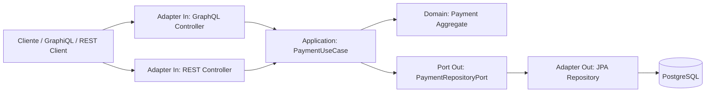

# PoC GraphQL Payment Processing - Java 25 + Spring Boot

PoC de un microservicio de **payment processing** que expone operaciones por **GraphQL** y endpoints **REST** para comparar ambos estilos. El caso aplica bien a GraphQL porque permite consultar pagos con campos específicos sin sobrecargar la respuesta, mientras REST queda como API operacional simple.

## Arquitectura



## Estructura principal

```text
src/main/java/com/acme/payments
├── domain                  # DDD: agregado Payment, status y value object Money
├── application             # Puertos de entrada/salida y caso de uso PaymentService
└── infrastructure          # Adaptadores GraphQL, REST, JPA y configuración
infrastructure
├── docker-compose.yml      # PostgreSQL
└── requests                # Ejemplos .http GraphQL y REST
```

## Código principal

- `Payment`: agregado de dominio. Controla transiciones `AUTHORIZED -> CAPTURED` y `AUTHORIZED -> REJECTED`.
- `Money`: value object que valida monto positivo y moneda ISO.
- `PaymentUseCase`: puerto de entrada de aplicación.
- `PaymentRepositoryPort`: puerto de salida para persistencia.
- `PaymentService`: caso de uso de autorización, captura, rechazo y consulta.
- `PaymentGraphqlController`: queries y mutations GraphQL.
- `PaymentRestController`: endpoints REST equivalentes.
- `PostgresPaymentRepositoryAdapter`: adapter JPA que implementa el puerto de persistencia.

## Requisitos

- JDK 25
- Maven 3.9+
- Docker / Docker Compose
- IntelliJ IDEA

## Levantar infraestructura

```bash
cd infrastructure
docker compose up -d
```

Validar PostgreSQL:

```bash
docker ps
```

## Ejecutar microservicio

Desde la raíz del proyecto:

```bash
mvn spring-boot:run
```

La configuración está en `src/main/resources/application.yml`.

## Abrir GraphiQL

```text
http://localhost:8080/graphiql
```

## Mutation GraphQL de ejemplo

```graphql
mutation {
  authorizePayment(input: {
    merchantId: "mrc_001",
    orderId: "ord_1001",
    customerId: "cus_9001",
    amount: 149.90,
    currency: "PEN"
  }) {
    id
    merchantId
    orderId
    amount
    currency
    status
  }
}
```

## Response GraphQL esperado

```json
{
  "data": {
    "authorizePayment": {
      "id": "uuid-generado",
      "merchantId": "mrc_001",
      "orderId": "ord_1001",
      "amount": 149.90,
      "currency": "PEN",
      "status": "AUTHORIZED"
    }
  }
}
```

## REST de ejemplo

```http
POST http://localhost:8080/payments/v1/payments
Content-Type: application/json

{
  "merchantId": "mrc_001",
  "orderId": "ord_1002",
  "customerId": "cus_9001",
  "amount": 99.90,
  "currency": "PEN"
}
```

## Notas de diseño

- Se usa PostgreSQL porque el pago requiere persistencia transaccional, idempotencia por `merchantId + orderId` y auditoría básica de estado.
- GraphQL vive como adapter de entrada; no contamina dominio ni aplicación.
- REST se mantiene para demostrar convivencia con APIs operacionales estándar.
- Flyway crea el esquema de base de datos al iniciar la app.
